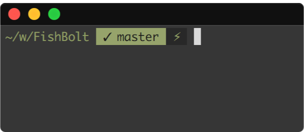

# FishBolt
> A well balanced one-line prompt for your fish shell


## Outside Git


## Git

### Clean


### Untracked files


### Modifications


### Ahead of origin


## Install

With [fisherman](https://fisherman.github.io)

```
fisher fuusle/fishbolt
```

## Depends on

* git_util (`git_ahead`)
* git_porcelain (the git modification part)
